# ⛅ Weather API Fetcher Simulator (Python Concurrency)

### **ผู้จัดทำ:** นายชินดนัย อภิบุญญา 
### **รหัสนักศึกษา:** 6810110570 
### **รายวิชา:** 240-123 Module Data Structure, Algorithms and Programming 

---

## 📖 บทนำ

&nbsp;&nbsp;&nbsp;&nbsp;&nbsp;&nbsp;&nbsp;&nbsp;&nbsp;&nbsp;โปรเจกต์ขนาดเล็กนี้ถูกพัฒนาขึ้นเพื่อเป็นส่วนหนึ่งของการศึกษาวิชา 240-123 โดยมีวัตถุประสงค์เพื่อทำความเข้าใจ และทดลองเขียนโปรแกรมแบบทำงานพร้อมกัน (Concurrency) ในภาษา Python ผ่านการใช้ไลบรารี `threading`, `asyncio` และ `Process Pool`

&nbsp;&nbsp;&nbsp;&nbsp;&nbsp;&nbsp;&nbsp;&nbsp;&nbsp;&nbsp;โปรแกรมนี้จะจำลองสถานการณ์จริงที่พบได้บ่อยในการพัฒนาซอฟต์แวร์ นั่นคือ **"การดึงข้อมูลสภาพอากาศจาก API หลายๆ แหล่ง"** เพื่อเปรียบเทียบให้เห็นถึงประสิทธิภาพและระยะเวลาที่ลดลง เมื่อนำเทคนิค Concurrency มาช่วยจัดการกับงานที่ต้องรอคอยเครือข่าย (I/O Bound) โดยมีการรันแบบเรียงลำดับปกติ (Sequential) เป็นเส้นฐาน (Baseline) เพื่อให้เห็นภาพเปรียบเทียบที่ชัดเจน

## 💡 ไอเดียนี้ทำอะไร และได้อะไร?

* **สิ่งที่ทำ:** โปรแกรมจะจำลองการขอข้อมูลสภาพอากาศจาก 5 เมือง (Bangkok, Tokyo, London, New York, Sydney) โดยดึงข้อมูลแบบ Real-time จาก Open-Meteo API
* **สิ่งที่ได้:** ได้เห็นข้อแตกต่างของเวลาอย่างชัดเจน
    * *หากรันแบบปกติ (Sequential):* ใช้เวลารวมเท่ากับระยะเวลาของทุกเมืองบวกกัน (ต้องรอให้เมืองแรกโหลดเสร็จ ถึงจะเริ่มโหลดเมืองต่อไป)
    * *หากรันด้วย Concurrency:* ใช้เวลารวมลดลงเหลือใกล้เคียงกับเมืองที่โหลดนานที่สุดเพียงเมืองเดียว

## 📊 สรุปผลการทดลอง

&nbsp;&nbsp;&nbsp;&nbsp;&nbsp;&nbsp;&nbsp;&nbsp;&nbsp;&nbsp;จากการรันโปรแกรมเพื่อเปรียบเทียบการทำงานทั้ง 4 รูปแบบ ได้ผลลัพธ์ความเร็วที่แตกต่างกันอย่างชัดเจนดังนี้:

<div align="center">
  <h3> ผลการทดลองเปรียบเทียบการทำงาน</h3>
  <br>
  
  <table border="0">
    <h3>------------------------- <b>Sequential (แบบปกติ)</b> -------------------------</h3>
    <tr>
      <td align="center" valign="top" style="padding: 10px;">
        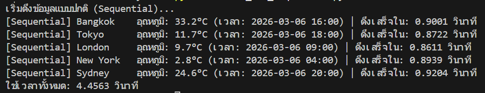<br>
        <br>
        <sub><b>ภาพที่ 1 ทดสอบ Sequential รอบ 1 </b></sub>
      </td>
    </tr>
    <tr>
      <td align="center" valign="top" style="padding: 10px;">
        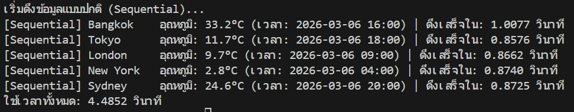<br>
        <br>
        <sub><b>ภาพที่ 2 ทดสอบ Sequential รอบ 2</b></sub>
      </td>
    </tr>
    <tr>
      <td align="center" valign="top" style="padding: 10px;">
        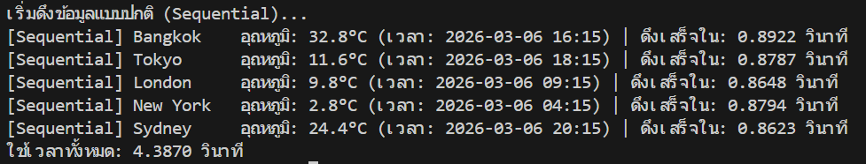<br>
        <br>
        <sub><b>ภาพที่ 3 ทดสอบ Sequential รอบ 3</b></sub>
      </td>
    </tr>
    <h3>------------------------- <b>Threading</b> -------------------------</h3>
    <tr>
      <td align="center" valign="top" style="padding: 10px;">
        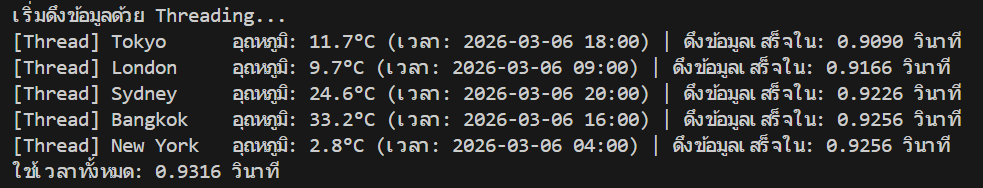<br>
        <br>
        <sub><b>ภาพที่ 4 ทดสอบ Threading รอบ 1</b></sub>
      </td>
    </tr>
    <tr>
      <td align="center" valign="top" style="padding: 10px;">
        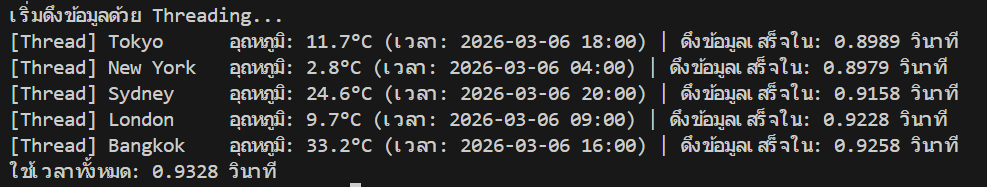<br>
        <br>
        <sub><b>ภาพที่ 5 ทดสอบ Threading รอบ 2</b></sub>
      </td>
    </tr>
    <tr>
      <td align="center" valign="top" style="padding: 10px;">
        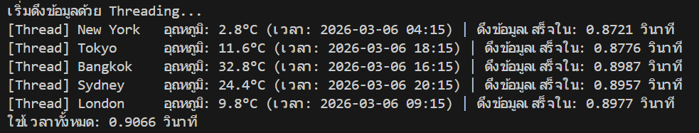<br>
        <br>
        <sub><b>ภาพที่ 6 ทดสอบ Threading รอบ 3</b></sub>
      </td>
    </tr>
    <h3>------------------------- <b>Asyncio</b> -------------------------</h3>
    <tr>
      <td align="center" valign="top" style="padding: 10px;">
        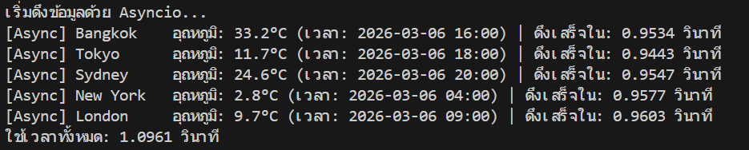<br>
        <br>
        <sub><b>ภาพที่ 7 ทดสอบ Asyncio รอบ 1</b></sub>
      </td>
    </tr>
    <tr>
      <td align="center" valign="top" style="padding: 10px;">
        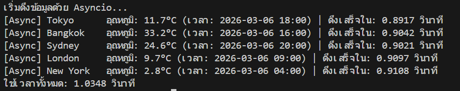<br>
        <br>
        <sub><b>ภาพที่ 8 ทดสอบ Asyncio รอบ 2</b></sub>
      </td>
    </tr>
    <tr>
      <td align="center" valign="top" style="padding: 10px;">
        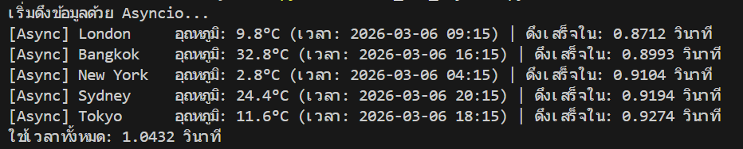<br>
        <br>
        <sub><b>ภาพที่ 9 ทดสอบ Asyncio รอบ 3</b></sub>
      </td>
    </tr>
    <h3>------------------------- <b>Process Pool</b> -------------------------</h3>
    <tr>
      <td align="center" valign="top" style="padding: 10px;">
        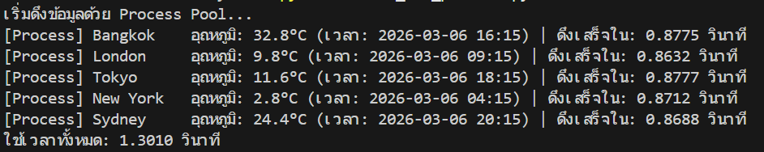<br>
        <br>
        <sub><b>ภาพที่ 10 ทดสอบ Process Pool รอบ 1</b></sub>
      </td>
    </tr>
    <tr>
      <td align="center" valign="top" style="padding: 10px;">
        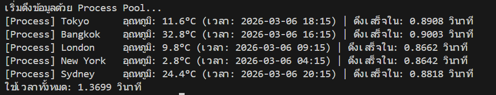<br>
        <br>
        <sub><b>ภาพที่ 11 ทดสอบ Process Pool รอบ 2</b></sub>
      </td>
    </tr>
    <tr>
      <td align="center" valign="top" style="padding: 10px;">
        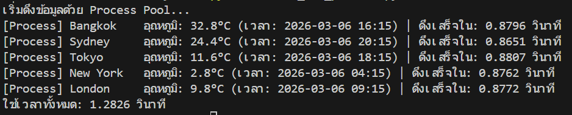<br>
        <br>
        <sub><b>ภาพที่ 12 ทดสอบ Process Pool รอบ 3</b></sub>
      </td>
    </tr>
  </table>
</div>

* 🔍 **วิเคราะห์ผลลัพธ์**
    * **Sequential (แบบปกติ):** ใช้เวลาเฉลี่ยประมาณ `4.0 - 5.0 วินาที` เพราะต้องทำทีละงานตามลำดับคิว
    * **Threading:** ใช้เวลาเฉลี่ยประมาณ `0.93 วินาที` เวลาที่ใช้จะเท่ากับระยะเวลาของเมืองที่โหลดนานที่สุดเพียงเมืองเดียว เนื่องจากทุกเมืองเริ่มโหลดพร้อมกัน
    * **Asyncio:** ใช้เวลาเฉลี่ยประมาณ `0.85 วินาที` ทำเวลาได้ดีเยี่ยมและประหยัดทรัพยากรเครื่องมากที่สุด เนื่องจากใช้การสลับการทำงานใน Thread เดียว (Event Loop) ทันทีเมื่อเกิดการรอคอยข้อมูล
    * **Process Pool:** ใช้เวลาเฉลี่ยประมาณ `1.50 วินาที` ใช้เวลามากกว่า Threading และ Asyncio เล็กน้อย เพราะมีเวลาสูญเสีย (Overhead) ไปกับการสร้าง Process ใหม่ขึ้นมาแยกกันอย่างอิสระ ถือเป็นการพิสูจน์ว่า Process Pool ไม่เหมาะกับงานดึงข้อมูลผ่านเน็ต แต่เหมาะกับงานคำนวณตัวเลขหนักๆ (CPU Bound) มากกว่า

## 🤔 ทำไมถึงเลือกทำเรื่องนี้?

&nbsp;&nbsp;&nbsp;&nbsp;&nbsp;&nbsp;&nbsp;&nbsp;&nbsp;&nbsp;การดึงข้อมูลจากภายนอก (เช่น API ของเซิร์ฟเวอร์ หรือ Database) เป็นสิ่งที่พบเจอได้บ่อยมากในการพัฒนาซอฟต์แวร์และเว็บไซต์จริง ปัญหาคืองานประเภทนี้มักจะมี **"ระยะเวลารอคอย"**

&nbsp;&nbsp;&nbsp;&nbsp;&nbsp;&nbsp;&nbsp;&nbsp;&nbsp;&nbsp;โปรแกรมนี้จึงถูกสร้างขึ้นมาเพื่อจำลองสถานการณ์ดังกล่าวให้เห็นภาพชัดเจนที่สุดว่า ความล่าช้าจากการรอเครือข่ายส่งผลต่อระยะเวลาทำงานรวมของโปรแกรมอย่างไร

## ⚙️ ทำไมถึงใช้เครื่องมือเหล่านี้ในไอเดียนี้?

&nbsp;&nbsp;&nbsp;&nbsp;&nbsp;&nbsp;&nbsp;&nbsp;&nbsp;&nbsp;งานดึงข้อมูลจากอินเทอร์เน็ตจัดเป็นงานประเภท **I/O Bound (Input/Output Bound)** ซึ่ง CPU แทบไม่ได้คำนวณอะไรเลย แต่ต้องเสียเวลารอข้อมูลเฉยๆ

&nbsp;&nbsp;&nbsp;&nbsp;&nbsp;&nbsp;&nbsp;&nbsp;&nbsp;&nbsp;การใช้ **Threading** และ **Asyncio** จึงตอบโจทย์ที่สุด เพราะมันอนุญาตให้โปรแกรม "สลับ" ไปทำงานอื่น (เช่น ไปสั่งดึงข้อมูลเมืองถัดไป) ในระหว่างที่กำลังรอข้อมูลของเมืองแรกอยู่ได้ ทำให้ไม่ต้องรอคิวทำงานทีละอัน ส่วน **Process Pool** ถูกนำมาทดสอบร่วมด้วยเพื่อให้เห็นข้อเปรียบเทียบของการกินทรัพยากรระบบที่มากกว่า เมื่อใช้ผิดประเภทงาน

## 🔄 วิธีการทำงานของโปรแกรม

1. โปรแกรมกำหนดรายชื่อเมืองเป้าหมายไว้ในรูปแบบ List พร้อมพิกัด Latitude และ Longitude
2. สร้างฟังก์ชันสำหรับการดึงข้อมูล API 
3. การทำงาน:
   * **Sequential:** วนลูป `for` ดึงข้อมูลทีละเมือง
   * **Concurrency:** สั่งให้ทุกงานเริ่มดึงข้อมูลพร้อมกันตามไลบรารีที่เลือกใช้ (`.start()`, `asyncio.gather()`, หรือ `.map()`)
4. โปรแกรมหลักจะรอให้ทุกงานทำงานจนเสร็จสมบูรณ์ 
5. สรุปผลและแสดงระยะเวลารวมทั้งหมดที่ใช้ไป

## 🚀 วิธีรันโปรแกรม

1. ติดตั้ง Python (เวอร์ชัน 3.x) ลงในเครื่องให้เรียบร้อย
2. ติดตั้งไลบรารีที่จำเป็นโดยพิมพ์คำสั่งใน Terminal: `pip install requests httpx`
3. เปิด Terminal หรือ Command Prompt แล้วเข้าไปที่โฟลเดอร์ของโปรเจกต์นี้
4. พิมพ์คำสั่งเพื่อรันโปรแกรมในรูปแบบที่ต้องการ:
   * รันทดสอบ Sequential: `python src/00_use_sequential.py`
   * รันทดสอบ Threading: `python src/01_use_thread.py`
   * รันทดสอบ Asyncio: `python src/02_use_asyncio.py`
   * รันทดสอบ Process Pool: `python src/03_use_process.py`

## 📁 โครงสร้างไฟล์

```text
weather-concurrency-lab/
│
├── images/                   
├── .gitignore
├── README.md                 # ไฟล์อธิบายรายละเอียดโปรเจกต์และวิธีการใช้งาน
└── src/
    ├── 00_use_sequential.py  # ทดสอบแบบปกติ (Baseline)
    ├── 01_use_thread.py      # ทดสอบ Threading
    ├── 02_use_asyncio.py     # ทดสอบ Asyncio
    └── 03_use_process.py     # ทดสอบ Process Pool